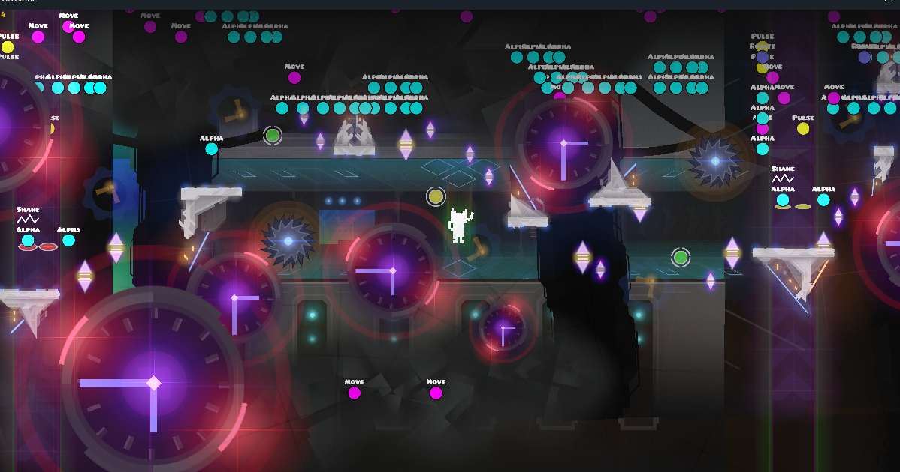
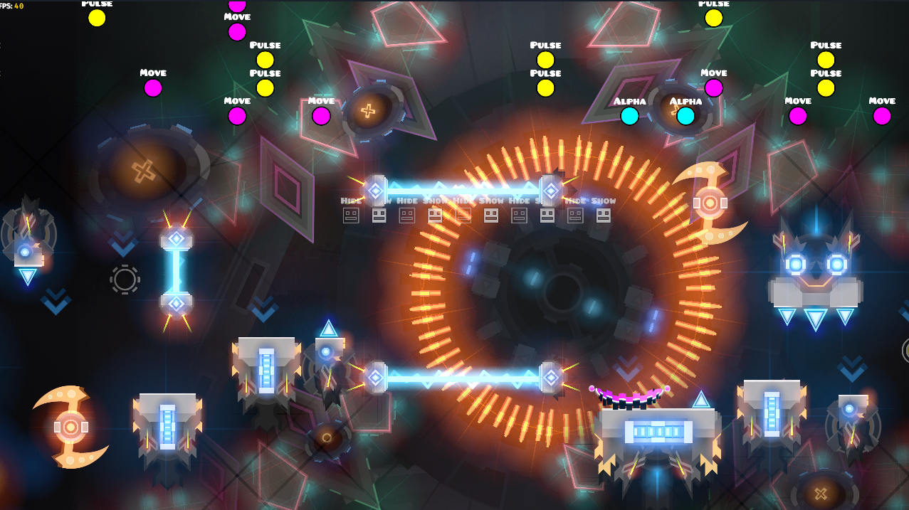
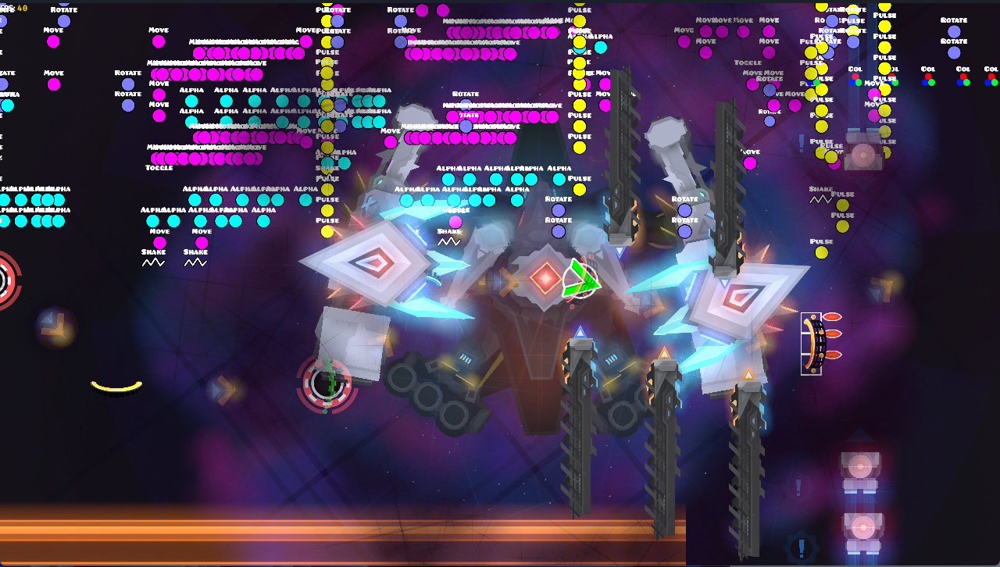
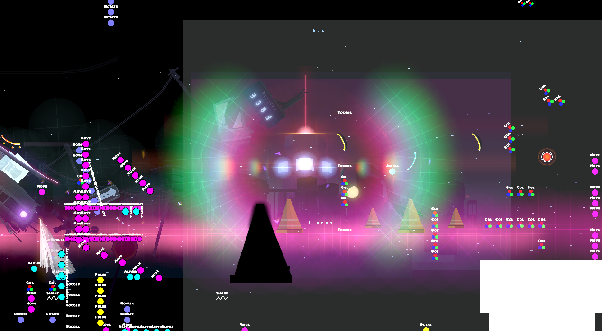
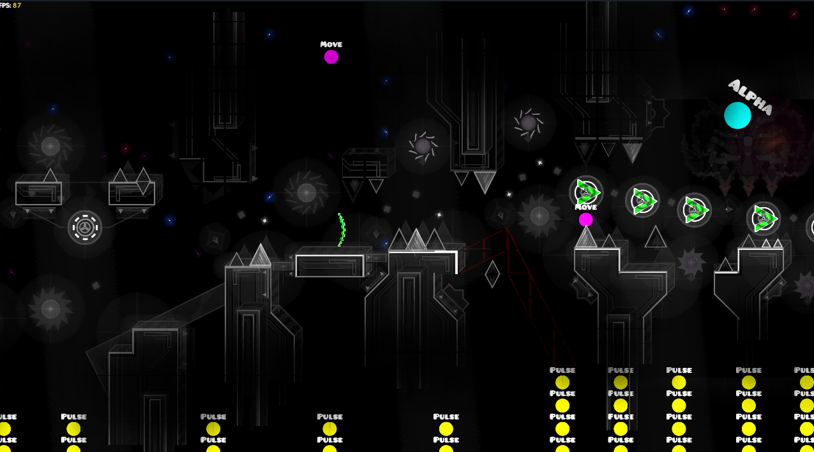

# NOTICE

This project is currently no longer on haitus, check the [rewrite branch](https://github.com/opstic/gdclone/tree/rewrite) for progress.

In the mean time, go take a look at [GDRender](https://github.com/maxnut/gdrender), [I helped a lot with the project over there](https://github.com/maxnut/gdrender#credits) and it's currently much more feature complete than the current GDClone. But efforts are expected to merge.

# GDClone

 

**An attempt at an alternative GD client.**

Built using Bevy engine and Rust.

## Usage

Grab the latest binary from [releases](https://github.com/opstic/gdclone/releases) then just run it.

A GD install and valid CCLocalLevels.dat are required.

**Binaries for Linux aren't available, so you'll need to compile it yourself.**

*Support for web and mobile platforms are planned.*

Controls are WASD to move, use arrow keys to move slower, hold left-shift to move faster.

Q and E to zoom in and out.

Use Esc to exit out of a level.

## Screenshots

### Credits

Thanks to [@maxnut](https://github.com/maxnut) for providing part of the original code to extract `object.json`.

#### License

Licensed under the Mozilla Public License 2.0

