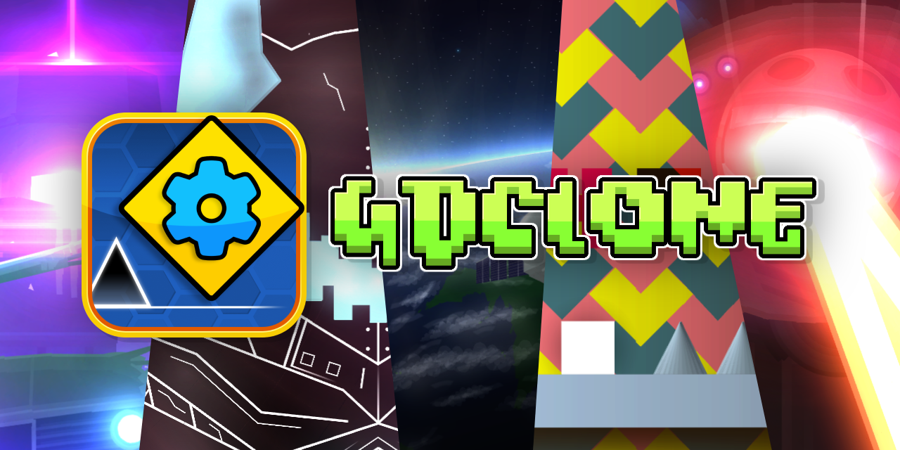

**An attempt at an alternative GD client.**

Built using Bevy engine and Rust.

***2.2 specific feature support is planned and will (hopefully) be started and finished soon.***

## Usage

Grab the latest binary from [releases](https://github.com/opstic/gdclone/releases) then just run it.

A web version is also available at https://opstic.github.io/gdclone/

A GD install is required.

Drag mouse around to move. Scroll wheel to zoom in and out.

WASD and arrow keys can also move the camera.

Q and E to also zoom in and out.

Esc to pause the player.

U to (un)lock the camera from the simulated player.

L to (de)activate player and camera line rendering.

T to (un)hide triggers.

R to reset zoom.

*Support for mobile platforms are planned.*

**NOTE: Either [kdialog](https://invent.kde.org/utilities/kdialog) or [zenity](https://github.com/GNOME/zenity) is
required on linux.**

## Screenshots / GIFs (GIFs are large, please wait for it to load)

### Credits

Thanks to [@maxnut](https://github.com/maxnut) for providing part of the original code to extract `object.json`.

#### License

Licensed under the Mozilla Public License 2.0
